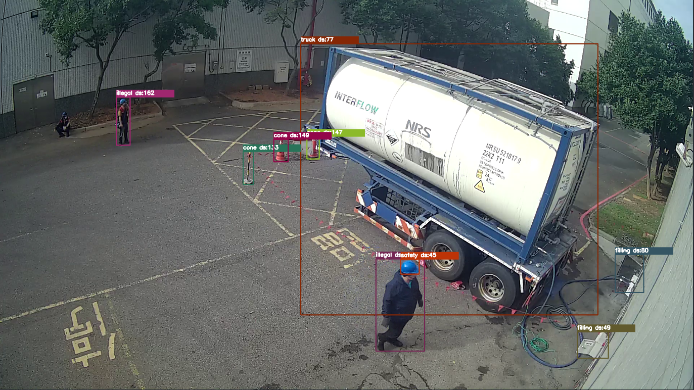

# YOLOv8-ZoeDepth-ZST
## 簡介

**此API使用了基於Pytorch的YOLO模型進行影像中的物件偵測。我們支援兩種版本的YOLO，分別是[YOLOv5](https://github.com/ultralytics/yolov5)和[YOLOv8](https://github.com/ultralytics/ultralytics)。除此之外，我們也提供了選擇性的[深度估計模型](https://github.com/isl-org/ZoeDepth)以進行影像中物體的深度估計。**

<p float="left">
  
   
  <br>
  <i>YOLOv5(左)  與  YOLOv8-seg(右) ZoeDepth深度估計</i>
</p>

## 模型下載
[ZoeDepth](https://github.com/isl-org/ZoeDepth/releases/download/v1.0/ZoeD_M12_N.pt) 放置於`./hub/checkpoints/ZoeD_M12_N.pt`
Yolov5,v8模型放置於`./models`

## API端點
以下是此API的主要端點:
- /: 顯示可用模型列表的端點
- /upload: 上傳圖片並進行物件偵測的端點

### 端點 /
**此端點用於取得當前可用的YOLO模型列表。**

方法: POST
回傳格式: JSON
回傳內容: 一個字典，鍵為模型名稱，值為'available'

## 端點 /upload
**此端點接受上傳的圖片並進行物件偵測。**

方法: POST
參數:
- Model_name: 選擇YOLO模型名稱，需符合當前可用模型列表的模型名稱。
- base64_str: 圖片的base64編碼字串，需包含 data:image/[image format];base64, 的前綴，例如 data:image/jpeg;base64,/9j/4AAQSk...
- Deep_model: 選擇是否使用ZoeDepth模型進行深度估算，需傳入Python的bool值字串，例如 "True" 或 "False"。
- version: YOLO模型版本，目前支援 "v5" 或 "v8"。

回傳格式: JSON
- 回傳內容: 每一個偵測到的物件都會有一個字典，字典的鍵包含 `name`、`class`、`confidence`、`xmin`、`ymin`、`xmax`、`ymax`
- 使用深度估算時會有 `deep`。
    - Yolov5 計算`bbox`內的深度中位數
    - Yolov8 計算`keypoints`(mask)所還蓋範圍內深度平均數
- 如果使用的是YOLOv8，還會包含 `keypoints`。

## 啟動方式
**可以在命令行介面下使用以下指令啟動此API:**
```shell
python main.py --device [運行設備] --port [端口]
```
其中，運行設備可以選擇 `cuda:0` 或 `cpu`，端口可以選擇例如 `5001` 或 `5002`。

## 範例
**請求範例**

```shell
curl -X POST "http://localhost:5001/upload" \
-H "Content-Type: application/json" \
-d '{
    "Model_name": "yolov5s",
    "base64_str": "data:image/jpeg;base64,/9j/4AAQSk...",
    "Deep_model": "True",
    "version": "v5"
}'

```

**回應範例**
```json
{
    "0": {
        "name": "person",
        "class": "0",
        "confidence": "0.99",
        "xmin": "116.52",
        "ymin": "34.41",
        "xmax": "167.94",
        "ymax": "224.88",
        "deep": "65"
    },
    "1": {
        "name": "bicycle",
        "class": "1",
        "confidence": "0.87",
        "xmin": "201.72",
        "ymin": "120.28",
        "xmax": "295.03",
        "ymax": "203.18",
        "deep": "77"
    }
}
```
